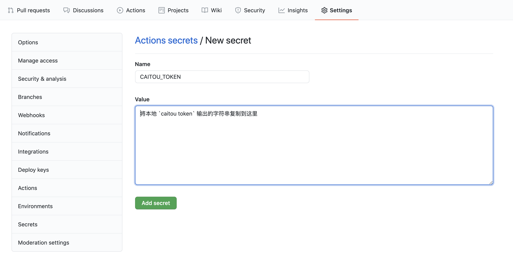

# 菜头云

简单的前端部署

- [提交问题](https://github.com/caitouyun/docs/issues)
- [前往讨论](https://github.com/caitouyun/docs/discussions)

## 安装

```sh
curl -sf https://cli.caitouyun.com/install.sh | sh
```

## 账号

```sh
caitou login
```

## 部署

我们假设当前目录为 demo,要部署的目录为 www, www 中包含了要部署的静态网站, 我们在 demo 目录中运行:

```sh
caitou deploy --site www --public www
```

会将目录文件上传后，返回两个网站预览地址

- https://demo-5c4992f8.caitouyun.com
  - 为中国大陆服务器地址，默认无法直接访问（内部已经验证的网站除外）
- https://demo-5c4992f8.caitou.org
  - 海外服务器地址, 可以直接访问
- 可以看到这次部署的子域名为 `demo-5c4992f8`，由网站 id 和一串唯一的字符串组成，代表了这次部署的链接

你可以修改本地文件之后重新运行 `caitou deploy --site www --public www` 来获得最新版本的预览链接

### 生产环境

如果需要部署生产环境，可以运行

```sh
caitou deploy --site www --public www --production
```

将会将本地当前版本部署到

- https://demo.caitouyun.com
- https://demo.caitou.org

两个镜像站点，访问和预览同样收到限制，但是 https://demo.caitouyun.com (国内镜像) 可以通过绑定一个备案过的域名访问

### 使用 `caitou.yml`

自定义域名通过本地文件 `demo/caitou.yml` 来配置，在这之前我们先定义部署网站名`site`和部署目录 `www`

```yaml
site: demo
public: www
```

这样在 demo 目录中就可以直接使用 `caitou deploy` 来部署预览链接以及 `caitou deploy --production`部署生产环境

### 自定义域名

在设定好`caitou.yml`之后可以通过 `domains` 下的 `china` 和 `global` 来分别对大陆镜像和海外镜像绑定自定义域名，两个都是可选配置

```yaml
domains:
  china: www.yourwesite.cn
  global: www.yourwebsite.com
```

绑定域名目前只支持 CNAME 的模式，比如以上配置就需要在 DNS 服务商中:

- 将 www.yourwesite.cn 指向 demo.caitouyun.com
- 将 www.yourwesite.com 指向 demo.caitou.org

配置好之后需要等待 DNS 服务器在全球更新，在本地可以通过运行命令 `dig CNAME www.yourwesite.cn` 来查看是否已经更新

我们使用 [Let's Encrypt](https://letsencrypt.org/) 给自定义域名自动配置 SSL 证书

### 自动跳转 https

在 `caitou.yml` 中 添加 `force_ssl: true` 之后访问所有的访问将自动跳转到 https

```yaml
site: demo
public: www
force_ssl: true
```

### 集成环境

将`caitou` 集成到现有的`git`集成部署环境中也是非常简单，使用 `caitou deploy --git` 会自动读取本地或者环境中的 git 信息来判断是预览环境还是生产环境，我们目前默认 `master` 的部署为生产环境部署

```sh
caitou deploy --git
```

### Github Actions

我们推荐使用官方的 [菜头云 Github Action](https://github.com/caitouyun/action)，

添加`CAITOU_TOKEN`环境变量，可以在本地登录之后运行

```sh
caitou token
```

将终端输出的 token 作为`CAITOU_TOKEN`变量复制到 github 项目中



创建目录 `.github/workflows` 并添加一个 yaml 文件

```yaml
name: CI
on:
  push:
    branches: [master]
jobs:
  build:
    runs-on: ubuntu-latest
    steps:
      - uses: actions/checkout@v2
      - uses: caitouyun/action@master
        with:
          args: caitou deploy --git
        env:
          CAITOU_TOKEN: ${{ secrets.CAITOU_TOKEN }}
```

如果需要其他的步骤，比如`npm install`也可以在部署之前添加
