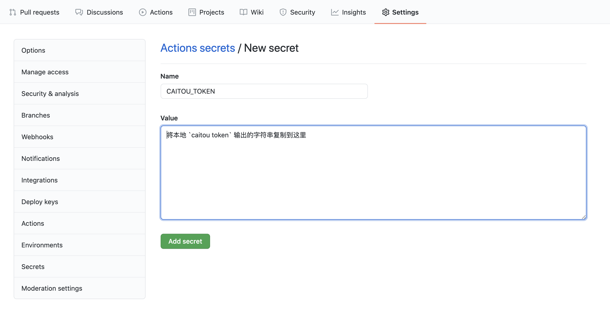

# 菜头云

菜头云 (https://caitouyun.com) 是一个简单的帮助开发者快速迭代和部署前端静态网站的服务

- 一个命令上线网站
- 多版本线上预览, 支持 git 集成
- 自定义域名和自动配置 HTTPS 证书
- 中国大陆和海外两个节点同时部署

## 目录

- [联系反馈](#联系反馈)
- [安装命令行](#安装命令行)
- [登录命令行](#登录命令行)
- [部署菜头云网站](#部署菜头云网站)
  - [网站名](#网站名)
  - [网站链接结构](#网站链接结构)
  - [预览环境](#预览环境)
  - [生产环境](#生产环境)
  - [使用 caitou\.yml 部署](#使用-caitouyml-部署)
  - [自定义域名](#自定义域名)
  - [自动跳转 https](#自动跳转-https)
  - [单页面应用 (Single Page Application)](#单页面应用-single-page-application)
  - [集成环境](#集成环境)
  - [Github Actions](#github-actions)
- [常见问题 FAQ](#常见问题-faq)
  - [我需要付费吗？有什么限制?](#我需要付费吗有什么限制)
  - [有没有网页控制面板可以查看网站列表和部署记录](#有没有网页控制面板可以查看网站列表和部署记录)
  - [有没有团队功能](#有没有团队功能)
  - [能不能自定义 SSL 证书](#能不能自定义-ssl-证书)
  - [我的网站有没有 CDN 加速](#我的网站有没有-cdn-加速)
  - [如何支持不带子域名的自定义域名 (Apex Domain)?](#如何支持不带子域名的自定义域名-apex-domain)
  - [菜头云和 GitHub Pages 有什么区别](#菜头云和-github-pages-有什么区别)

## 联系反馈

- [通过邮箱直接联系我们](mailto:contact@swiftcarrot.com)
- [帮助我们编辑文档](https://github.com/caitouyun/docs/edit/master/README.md)
- [使用中遇到问题提交 issue](https://github.com/caitouyun/docs/issues)
- [相关功能讨论](https://github.com/caitouyun/docs/discussions)

## 安装命令行

在终端中运行以下命令安装

```sh
curl -sf https://cli.caitouyun.com/install.sh | sh
```

安装成功后运行 `caitou version` 输出当前版本则表明安装成功。

## 登录命令行

使用菜头云部署需要一个账号, 运行

```sh
caitou login
```

会在浏览器中打开一个网页链接，如果没有登录可以先使用 GitHub 账号登录 (目前暂时只支持 GitHub 账号登录), 在注册或者登录成功后会返回一个授权页面, 点击确认之后窗口会自动关闭, 同时终端会显示 `登录成功` 。

运行

```sh
caitou whoami
```

如果成功输出了个人账号信息则表示在命令行已经登录成功

登录成功之后会在本地 `~/.caitou/env` 保存一个 `CAITOU_TOKEN` 的环境变量用于命令行的验证, 运行

```sh
caitou token
```

会在终端输出该 token, 请保护好这个 token 仅自己可见, 相当于用户登录使用的密码。

## 部署菜头云网站

### 网站名

- 每个菜头云网站都有一个唯一的网站名
- 网站名只能包括数字和小写字母, 比如 `demo123`
- 网站在部署的时候如果网站名没有被使用则会自动创建新网站
- 如果网站名已经被别人占用则会返回部署失败

### 网站链接结构

我们以 demo 这个网站名为例，在菜头云上包括以下几种链接结构

- 唯一的生产环境链接, 可以绑定自定义域名
  - 中国大陆 https://demo.caitouyun.com
  - 海外 https://demo.caitou.org
- 每次部署产生的预览链接
  - 中国大陆 https://demo-5c4992f8.caitouyun.com
  - 海外 https://demo-5c4992f8.caitou.org
- 使用 git 分支(branch)生成的分支预览链接 (以 dev 分支为例)
  - 中国大陆 https://demo-git-dev.caitouyun.com
  - 海外 https://demo-git-dev.caitou.org

接下来我们会介绍如何部署生成这些线上链接以及如何绑定自定义域名到生成环境

### 预览环境

我们部署的项目代码在 [caitouyun/demo](https://github.com/caitouyun/demo), 我们假设当前目录为 `demo`,要部署的目录为 `www`, `www` 中包含了要部署的静态网站, 我们在 `demo` 目录中运行:

```sh
caitou deploy --site demo --public www
```

**需要将 `demo` 改成你要部署的新网站名，否则因为已经被占用会部署出错**

运行之后会将目录文件 `www` 上传并部署到菜头云, 部署成功后返回两个网站预览地址

- https://demo-5c4992f8.caitouyun.com
  - 为中国大陆服务器地址，默认无法直接访问
- https://demo-5c4992f8.caitou.org
  - 海外服务器地址, 可以直接访问
- 可以看到这次部署的子域名为 `demo-5c4992f8`，由网站 id 和一串唯一的字符串组成，代表了这次部署的预览链接
- 网站有的时候第一次访问因为没有缓存访问会比较慢，在缓存构建后速度会明显提升

每次部署都会返回新的预览链接, 你可以修改本地文件之后重新运行 `caitou deploy --site demo --public www` 来获得最新版本的预览链接

### 生产环境

如果需要部署生产环境，可以运行

```sh
caitou deploy --site demo --public www --production
```

将会将本地当前版本部署到

- https://demo.caitouyun.com
  - 为中国大陆服务器地址，默认无法直接访问, **但可以通过绑定一个备案过的域名访问**
- https://demo.caitou.org
  - 海外服务器地址, 可以直接访问

### 使用 `caitou.yml` 部署

自定义域名通过本地文件 `[demo/caitou.yml](https://github.com/caitouyun/demo/blob/master/caitou.yml)` 来配置，在这之前我们先定义部署网站名 `site` 和部署目录 `www`

```yaml
site: demo
public: www
```

这样在 `demo` 目录中就可以直接使用 `caitou deploy` 来部署预览链接以及 `caitou deploy --production` 部署生产环境

### 自定义域名

在设定好`caitou.yml` 之后可以通过 `domains` 下的 `china` 和 `global` 来分别对大陆镜像和海外镜像绑定自定义域名，两个都是可选配置, 比如

```yaml
domains:
  china: www.yourwesite.cn
  global: www.yourwebsite.com
```

绑定域名目前只支持 CNAME 的模式，比如以上配置就需要在你的域名解析服务商中设置:

- 将 www.yourwesite.cn 指向 demo.caitouyun.com
- 将 www.yourwesite.com 指向 demo.caitou.org

配置好之后需要等待 DNS 服务器在全球更新，在本地可以通过运行命令 `dig CNAME www.yourwesite.cn` 来查看是否已经更新

对于自定义域名我们使用 [Let's Encrypt](https://letsencrypt.org/) 给自定义域名自动配置 SSL 证书

### 自动跳转 https

在 `caitou.yml` 中 添加 `force_ssl: true` 之后所有的访问将自动跳转到 https, 比如

```yaml
site: demo
public: www
force_ssl: true
```

### 单页面应用 (Single Page Application)

查看代码 [caitouyun/demo-spa](https://github.com/caitouyun/demo-spa)

菜头云支持自定义路由规则，可以很方便的支持单页面应用(Single Page Application), 在 `caitou.yml` 中添加以下 `rewrites` 规则就可以将请求重写到 `/index.html` 来指出前端单页面应用

```yaml
rewrites:
  - source: '**'
    destination: /index.html
```

更多详细的 `rewrites` 文档正在补充中...

### 集成环境

将菜头云集成到现有的 git 集成部署环境中也非常容易，使用 `caitou deploy --git` 会自动读取本地或者集成环境中的 git 信息来判断环境

- 我们目前默认 `main` 分支的部署为生产环境部署
- 对于其他的分支会自动部署到分支预览网站, 子域名格式为 `网站名-git-分支`

```sh
caitou deploy --git
```

如果需要修改默认的生产环境分支(`main`)可以在 `caitou.yml` 中定义, 比如使用 `master` 分支

```yaml
site: demo
production_branch: master
public: www
```

### Github Actions

我们推荐使用官方的 [菜头云 Github Action](https://github.com/caitouyun/action)，

首先需要在项目中添加 `CAITOU_TOKEN` 环境变量，可以在本地命令行登录之后运行

```sh
caitou token
```

将终端输出的 token 作为 `CAITOU_TOKEN` 变量复制到 GitHub 项目中



创建目录 `.github/workflows` 并添加一个 `caitouyun.yaml` 文件

```yaml
name: caitouyun
on:
  push:
    branches: [main]
jobs:
  build:
    runs-on: ubuntu-latest
    steps:
      - uses: actions/checkout@v2
      - uses: caitouyun/action@master
        with:
          args: caitou deploy --git
        env:
          CAITOU_TOKEN: ${{ secrets.CAITOU_TOKEN }}
```

提交代码之后每一次提交代码都会通过 Github Actions 运行菜头云部署生成一个预览链接，对于 `main` 分支的提交则会自动部署到生成环境

如果需要其他的步骤，比如 `npm install` 也可以在部署之前添加，可以参考 [单页面 demo 的配置](https://github.com/caitouyun/demo-spa/blob/main/.github/workflows/caitouyun.yml)

## 常见问题 FAQ

### 我需要付费吗？有什么限制?

我们目前正在测试中，所有的功能都是免费的

### 有没有网页控制面板可以查看网站列表和部署记录

网页版 https://app.caitouyun.com 正在测试中，我们会尽快开放给用户使用

### 有没有团队功能

和网页控制面板一起会尽快对外开放

### 能不能自定义 SSL 证书

目前命令行没有提供这样的功能，但是可以[联系我们](mailto:contact@swiftcarrot.com)

### 我的网站有没有 CDN 加速

目前没有 CDN 加速集成，但是依旧可以通过我们的子域名对接到 CDN，我们之后会添加 CDN 的自动集成

### 如何支持不带子域名的自定义域名 (Apex Domain)?

目前没有提供这方面的功能，但是可以[联系我们](mailto:contact@swiftcarrot.com)帮助添加

### 菜头云和 GitHub Pages 有什么区别

- 菜头云支持多次部署多次预览的功能, 并不需要你将文件上传到 git 目录或者某个分支
- Github Pages 免费用户不能使用私有项目部署， 菜头云甚至不要求有一个 git 项目，只需要有一个目录就能部署
- 菜头云提供了大陆和海外两个镜像，并且提供了 `rewrites` 等高级配置功能
